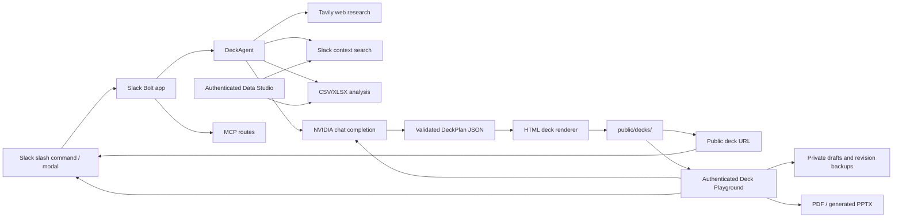

# PioltPPT


PioltPPT is a Slack-first presentation agent. It turns a slash command, permitted Slack context, web research, user notes, and uploaded CSV/XLSX data into a professional live presentation that can be edited in the browser and shared as HTML, PDF, or PPTX.

The current baseline is focused on a reliable local Slack workflow:

- `/pioltppt <topic>` creates a clean, text-first presentation from the actual request and available evidence.
- `/pioltppt` opens a Slack modal for more detailed control.
- CSV/XLSX files can be uploaded in Slack or Data Studio to create computed, cited data slides.
- Generated decks are served as HTML under `/decks/<deckId>/` and edited through an authenticated playground.
- The editor supports bounded slide-level AI changes, manual HTML/field edits, image uploads, PDF printing, and PPTX export.
- Decks can be revised from Slack using the generated deck ID.
- The app exposes Slack routes, health checks, Data Studio, and MCP endpoints from the same Node server.

## Table Of Contents

- [Project Status](#project-status)
- [Features](#features)
- [Tech Stack](#tech-stack)
- [Architecture](#architecture)
- [Repository Structure](#repository-structure)
- [Prerequisites](#prerequisites)
- [Environment Variables](#environment-variables)
- [Local Setup](#local-setup)
- [Slack App Setup](#slack-app-setup)
- [Running The App](#running-the-app)
- [Common Commands](#common-commands)
- [Testing And Validation](#testing-and-validation)
- [Deck Generation Flow](#deck-generation-flow)
- [Safety Notes](#safety-notes)
- [Roadmap](#roadmap)

## Project Status

This repository contains the working local prototype of PioltPPT.

Implemented:

- Slack slash commands, mentions, direct messages, Block Kit modals, and fast acknowledgement before long-running work.
- AI deck planning through NVIDIA's OpenAI-compatible API with validated plans and source-grounded fallback content.
- Text-first HTML decks with responsive layouts, transitions, notes, citations, and an enforced final **Thank You** slide.
- CSV/XLSX profiling, computed charts, data citations, Slack file intake, and authenticated Data Studio uploads.
- Keyword-based Slack evidence search with date/person filters when the required user authorization and scopes are available.
- A resizable browser editor with full HTML, live preview, source navigation, inline text/image fields, bounded slide-only AI editing, drafts, revisions, and Slack publication.
- PDF print flow and generated PPTX export. PPTX text is synchronized from the current saved editor draft.
- MCP HTTP and stdio entry points.

Current limitations:

- Decks, uploads, exports, Slack installations, and editor revisions are stored on local disk; production deployments need durable private storage and a database.
- Data Studio does not use the process-wide Slack user token. Until per-user OAuth token resolution is added, Slack evidence may report that user-scoped search authorization is unavailable.
- Slack research is grounded keyword search plus filters, not semantic RAG or an embeddings index.
- PDF/PPTX template uploads are stored as references only. Native PowerPoint masters, layouts, placeholders, and exact template fidelity are not imported or preserved.
- PPTX export is a clean generated presentation; complex arbitrary HTML/CSS and manually inserted images are not reproduced with pixel-perfect fidelity.
- Images are not searched by default. A slide receives an image only from a requester-supplied URL or uploaded file.

## Features

### Slack Deck Generation

Use a Slack slash command to generate a deck:

```text
/pioltppt ANNA UNIVERSITY REGIONAL CAMPUS COIMBATORE overview
```

For custom inputs, run:

```text
/pioltppt
```

The modal supports:

- topic or rough prompt
- presenter names
- audience
- slide count
- tone
- brand style
- Slack context toggle
- web research toggle
- explicit slide image URLs
- citations
- speaker notes
- custom links and notes
- advanced prompt instructions

### Live Presentation Website

Each generated deck is rendered as a standalone HTML presentation site with:

- slide navigation
- keyboard controls
- speaker notes panel
- source panel
- progress bar
- print/PDF-friendly mode
- persisted `deck.json` manifest for revision

### Revision Flow

After a deck is generated, Slack returns a deck ID. A revision can be requested from the Slack button or with a direct message style command:

```text
revise <deckId> make slide 2 more executive and reduce text
```

### Deck Playground

Every completed Slack response includes an authenticated **Open editor** button. Deck Playground provides:

- a sandboxed live presentation preview
- the complete editable `index.html` source
- source navigation for headings, paragraph text, and image `src` values
- an AI assistant for slide-specific text and layout changes
- image upload directly into a selected slide
- separate draft saving without changing the live deck
- automatic revision backups on publication
- a **Finish editing** action that publishes the HTML and posts the refreshed deck link back to Slack

PioltPPT never inserts a dummy image. A request such as `slide 2: image right` needs an uploaded image or explicit HTTP(S) image URL before a visual is added. User images use contained layouts by default so the full image remains visible.

The AI assistant is deliberately bounded: it receives only the requested slide article blocks plus a limited deck-style context, must return the same slide numbers in strict JSON, and cannot replace the full document. Unsafe tags, event attributes, external CSS, unapproved image URLs, changed slide identities, and malformed/missing patches are rejected without modifying the draft.

### Data Studio And Evidence

The authenticated Data Studio link supports:

- one or more CSV/XLSX uploads (20 MB per file)
- row/column/type/sample profiling
- computed category/date charts
- file and worksheet citations on data slides
- optional Slack keyword evidence query with inclusive date and person filters
- PDF/PPTX reference-file storage with explicit fidelity limitations
- direct links to the generated deck and editor

Slack search only returns content visible to the authorized Slack identity. Missing user scopes/tokens are reported as an unavailable capability; the app does not claim evidence when search fails.

### Export

- **HTML:** the published deck under `/decks/<deckId>/`.
- **PDF:** browser print/save-to-PDF using the current editor HTML.
- **PPTX:** a generated widescreen OOXML presentation using current saved slide text, citations, and supported charts. Arbitrary web CSS, uploaded images, and native template masters are not yet reproduced exactly.

### MCP Support

The app includes MCP routes and a stdio entry point so the same deck-generation capability can be exposed to compatible agent clients.

## Tech Stack

| Layer | Technology |
| --- | --- |
| Runtime | Node.js, TypeScript, tsx |
| Slack Integration | Slack Bolt, Slack Web API |
| HTTP Server | Express |
| AI Planning/Editing | NVIDIA NIM/OpenAI-compatible chat completions |
| Web Research | Tavily |
| Data Processing | `csv-parse`, ExcelJS |
| Export | PptxGenJS, browser print/PDF |
| Optional Asset Search Tool | Openverse MCP tool (not used by default deck generation) |
| MCP | `@modelcontextprotocol/sdk` |
| Validation | Zod, bounded HTML fragment validation |
| Logging | Pino, pino-http |
| IDs | nanoid |
| Tests | Vitest |
| Linting | ESLint, typescript-eslint |

## Architecture



### Main Components

| Path | Responsibility |
| --- | --- |
| `src/index.ts` | Starts the Express/Slack server and mounts routes. |
| `src/config.ts` | Loads and validates environment configuration. |
| `src/slack/app.ts` | Registers Slack slash commands, actions, modals, events, and revision flow. |
| `src/slack/blocks.ts` | Builds Slack Block Kit UI and parses modal submissions. |
| `src/agent/deckAgent.ts` | Orchestrates research, context gathering, AI deck planning, fallback planning, rendering, and revision. |
| `src/deck/render.ts` | Renders deck plans into live static HTML presentations. |
| `src/editor/routes.ts` | Serves authenticated editor, draft, AI, image upload, and publish APIs. |
| `src/editor/page.ts` | Renders the responsive Deck Playground interface. |
| `src/editor/security.ts` | Creates and validates per-deck editor access tokens. |
| `src/services/nvidia.ts` | Calls NVIDIA's OpenAI-compatible chat completion API. |
| `src/services/tavily.ts` | Fetches web research results. |
| `src/services/openverse.ts` | Fetches licensed image metadata. |
| `src/services/slackSearch.ts` | Performs permitted Slack keyword search with date/person filters and grounded evidence. |
| `src/services/dataAnalysis.ts` | Profiles CSV/XLSX data and creates computed, cited data slides. |
| `src/services/uploads.ts` | Validates and stores private data/template uploads. |
| `src/services/pptxExport.ts` | Creates generated PPTX files and synchronizes saved editor text. |
| `src/workspace/routes.ts` | Serves authenticated Data Studio upload, generation, and research APIs. |
| `src/mcp/server.ts` | Exposes MCP-compatible HTTP routes. |
| `src/mcp/stdio.ts` | Provides an MCP stdio server entry point. |
| `src/storage/files.ts` | Handles local JSON/file persistence. |
| `tests/render.test.ts` | Verifies static deck rendering. |
| `tests/editor.test.ts` | Verifies editor authentication, bounded AI patches, uploads, drafts, backups, and publishing. |
| `tests/dataAnalysis.test.ts` | Verifies real CSV/XLSX profiling, charts, slide limits, and citations. |
| `tests/pptxExport.test.ts` | Verifies editor-text synchronization and OOXML/PPTX output. |
| `tests/slackSearch.test.ts` | Verifies mocked Slack query, date, person, evidence, and missing-scope behavior. |
| `tests/editorPage.test.ts` | Verifies selected-slide image-removal state and editor wiring. |
| `tests/fallback.test.ts` | Verifies relevant source-grounded fallback content and no dummy images. |

## Repository Structure

```text
.
├── docs/
│   └── DEPLOYMENT.md
├── public/
│   └── decks/              # generated at runtime, ignored by Git
├── src/
│   ├── agent/
│   ├── deck/
│   ├── mcp/
│   ├── services/
│   ├── slack/
│   ├── storage/
│   ├── config.ts
│   ├── index.ts
│   ├── logger.ts
│   ├── safety.ts
│   └── types.ts
├── tests/
├── .env.example
├── package.json
├── tsconfig.json
├── tsconfig.build.json
└── vitest.config.ts
```

## Prerequisites

- Node.js 20 or newer. The local setup has been tested with Node.js 24.
- npm.
- A Slack app with slash commands and interactivity enabled.
- NVIDIA API key for chat completions.
- Optional Tavily API key for web research.
- Optional public HTTPS tunnel for local Slack testing, such as ngrok or Cloudflare Tunnel.

## Environment Variables

Copy the example file:

```bash
cp .env.example .env
```

On Windows PowerShell:

```powershell
Copy-Item .env.example .env
```

Required values:

```text
PORT=3000
PUBLIC_BASE_URL=https://your-public-tunnel-or-domain
SLACK_SIGNING_SECRET=
SLACK_STATE_SECRET=replace-with-a-long-random-string
NVIDIA_API_KEY=
```

For single-workspace local testing, provide a bot token:

```text
SLACK_BOT_TOKEN=xoxb-...
```

Recommended optional values:

```text
SLACK_USER_TOKEN=xoxp-... # single-workspace/local Slack search only
TAVILY_API_KEY=
OPENVERSE_BASE_URL=https://api.openverse.engineering/v1
```

For production multi-user Slack research, resolve a user-scoped OAuth token for the requesting Slack user. Data Studio intentionally does not reuse a process-wide user token because that could expose messages visible to a different identity.

Do not commit `.env`. It is intentionally ignored.

## Local Setup

Install dependencies:

```bash
npm install
```

Run type checks:

```bash
npm run typecheck
```

Run tests:

```bash
npm test
```

Build production JavaScript:

```bash
npm run build
```

## Slack App Setup

Create a Slack app and point these URLs to your public base URL:

```text
Slash command:       https://your-domain.example/slack/events
Interactivity:       https://your-domain.example/slack/events
Event subscriptions: https://your-domain.example/slack/events
OAuth redirect:      https://your-domain.example/slack/oauth_redirect
MCP server:          https://your-domain.example/mcp
```

The slash command should be:

```text
/pioltppt
```

Useful routes:

```text
/healthz
/slack/events
/slack/install
/slack/oauth_redirect
/slack/manifest
/mcp
/decks/<deckId>/
/editor/<deckId>#token=...
/workspace/<userId>?token=...
```

The app can generate a Slack manifest file:

```bash
npm run manifest
```

## Running The App

Development mode:

```bash
npm run dev
```

Production mode:

```bash
npm run build
npm start
```

Health check:

```bash
curl http://localhost:3000/healthz
```

PowerShell:

```powershell
Invoke-RestMethod http://localhost:3000/healthz
```

If port `3000` is already in use on Windows:

```powershell
netstat -ano | findstr :3000
tasklist /FI "PID eq <PID>"
taskkill /PID <PID> /F
```

Then restart:

```bash
npm run dev
```

## Common Commands

Generate a deck from Slack:

```text
/pioltppt Affintrix Technologies Private Limited overview
```

Open the full Slack modal:

```text
/pioltppt
```

Revise a generated deck:

```text
revise <deckId> make the title slide cleaner and reduce slide 3 text
```

Run local checks:

```bash
npm run typecheck
npm test
npm run lint
npm run build
```

## Testing And Validation

Current automated checks:

- TypeScript compile check with `npm run typecheck`.
- Vitest coverage for rendering, fallbacks, bounded editor changes, uploads, data analysis, citations, Slack filters, image controls, and PPTX output with `npm test`.
- ESLint with `npm run lint`.
- Production build with `npm run build`.

Manual validation checklist:

1. Start the server with `npm run dev`.
2. Confirm `/healthz` returns `{ "ok": true }`.
3. Run `/pioltppt <custom topic>` in Slack.
4. Open the returned deck link.
5. Navigate slides with the buttons and arrow keys.
6. Toggle notes with `N`.
7. Toggle sources with `S`.
8. Try a revision from Slack.

## Deck Generation Flow

1. Slack receives `/pioltppt`.
2. The app parses either direct text or modal input.
3. The request is sanitized and normalized.
4. Optional research/context services run in parallel.
5. CSV/XLSX inputs, Slack keyword evidence, and web research are gathered as requested.
6. NVIDIA generates a structured deck plan and retries with the primary model if validation fails; data decks use computed profiles/charts rather than guessed figures.
7. Zod validates AI plans. If both AI plans fail, verified source snippets or a safe topic-specific fallback produce the slides.
8. Normalization guarantees a final **Thank You** slide and the renderer writes `index.html` and `deck.json`.
9. Slack receives public deck, authenticated editor, Data Studio, and revision links.
10. Deck Playground saves private drafts, applies bounded slide patches, exports, and publishes final HTML back to the original Slack conversation.

One-shot slash commands remain text-only by default. Images appear only when the requester supplies a URL or uploads an image in Deck Playground.

## Safety Notes

Ignored by Git:

- `.env`
- `.env.*`
- `node_modules/`
- `dist/`
- `data/`
- `workspace/`
- `public/decks/`
- logs
- generated Slack manifest

Before production:

- Rotate any token that was pasted into a local log or chat.
- Move local deck storage to durable object storage.
- Move Slack installation storage to a database.
- Add rate limiting.
- Add workspace-level access checks for private decks.
- Add job queues for long-running generation.

## Roadmap

High-priority production upgrades:

- Per-user Slack OAuth token resolution for Data Studio research.
- Durable private object storage, database-backed installations, retention controls, and background jobs.
- Native PPTX template/master/placeholder processing and richer HTML-to-PPTX layout fidelity.
- Image decoding/re-encoding in an isolated worker and stricter document-processing resource limits.
- Workspace-level deck authorization, rate limiting, audit logging, and deployment observability.
- Optional semantic Slack indexing only after permissions, storage, retention, and privacy controls are defined.

## License

MIT
