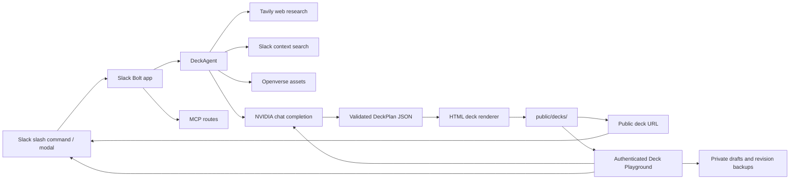

# PioltPPT


PioltPPT is a Slack-first presentation generation agent. It turns a slash command, Slack context, web research, and optional user notes into a live presentation website that can be opened, revised, navigated, and printed as a deck.

The current baseline is focused on a reliable local Slack workflow:

- `/pioltppt <topic>` creates a clean presentation from a custom title or prompt.
- `/pioltppt` opens a Slack modal for more detailed control.
- Generated decks are served as static HTML under `/decks/<deckId>/`.
- Decks can be revised from Slack using the generated deck ID.
- The app exposes Slack routes, health checks, and MCP endpoints from the same Node server.

## Table Of Contents

- [Project Status](#project-status)
- [Features](#features)
- [Tech Stack](#tech-stack)
- [Architecture](#architecture)
- [Repository Structure](#repository-structure)
- [Prerequisites](#prerequisites)
- [Environment Variables](#environment-variables)
- [Local Setup](#local-setup)
- [Slack App Setup](#slack-app-setup)
- [Running The App](#running-the-app)
- [Common Commands](#common-commands)
- [Testing And Validation](#testing-and-validation)
- [Deck Generation Flow](#deck-generation-flow)
- [Safety Notes](#safety-notes)
- [Roadmap](#roadmap)

## Project Status

This repository contains the working local prototype of PioltPPT.

Completed baseline:

- Slack slash command handling.
- Slack interactive modal flow.
- AI-generated deck planning through NVIDIA's OpenAI-compatible API.
- Optional Tavily web research.
- Optional Openverse licensed image lookup.
- Static live deck renderer.
- Deck revision flow.
- MCP HTTP and stdio entry points.
- Local development through Cloudflare Tunnel or any public HTTPS tunnel.

Current limitations:

- One-shot slash command decks intentionally disable random licensed images by default to avoid unrelated visuals.
- Generated decks are stored on local disk.
- Slack installations are stored in the local filesystem.
- The renderer is functional and clean, but advanced themes, custom color palettes, image layout controls, and export polish are planned for the next UI/UX branch.

## Features

### Slack Deck Generation

Use a Slack slash command to generate a deck:

```text
/pioltppt ANNA UNIVERSITY REGIONAL CAMPUS COIMBATORE overview
```

For custom inputs, run:

```text
/pioltppt
```

The modal supports:

- topic or rough prompt
- presenter names
- audience
- slide count
- tone
- brand style
- Slack context toggle
- web research toggle
- explicit slide image URLs
- citations
- speaker notes
- custom links and notes
- advanced prompt instructions

### Live Presentation Website

Each generated deck is rendered as a standalone HTML presentation site with:

- slide navigation
- keyboard controls
- speaker notes panel
- source panel
- progress bar
- print/PDF-friendly mode
- persisted `deck.json` manifest for revision

### Revision Flow

After a deck is generated, Slack returns a deck ID. A revision can be requested from the Slack button or with a direct message style command:

```text
revise <deckId> make slide 2 more executive and reduce text
```

### Deck Playground

Every completed Slack response includes an authenticated **Open editor** button. Deck Playground provides:

- a sandboxed live presentation preview
- the complete editable `index.html` source
- source navigation for headings, paragraph text, and image `src` values
- an AI assistant for slide-specific text and layout changes
- image upload directly into a selected slide
- separate draft saving without changing the live deck
- automatic revision backups on publication
- a **Finish editing** action that publishes the HTML and posts the refreshed deck link back to Slack

When a command requests an image position without a URL, such as `slide 2: image right`, PioltPPT inserts a replaceable sample image. The image source can be changed directly in Deck Playground or replaced through the assistant/upload flow.

### MCP Support

The app includes MCP routes and a stdio entry point so the same deck-generation capability can be exposed to compatible agent clients.

## Tech Stack

| Layer | Technology |
| --- | --- |
| Runtime | Node.js, TypeScript, tsx |
| Slack Integration | Slack Bolt, Slack Web API |
| HTTP Server | Express |
| AI Planning | NVIDIA NIM/OpenAI-compatible chat completions |
| Web Research | Tavily |
| Licensed Assets | Openverse |
| MCP | `@modelcontextprotocol/sdk` |
| Validation | Zod |
| Logging | Pino, pino-http |
| IDs | nanoid |
| Tests | Vitest |
| Linting | ESLint, typescript-eslint |

## Architecture



### Main Components

| Path | Responsibility |
| --- | --- |
| `src/index.ts` | Starts the Express/Slack server and mounts routes. |
| `src/config.ts` | Loads and validates environment configuration. |
| `src/slack/app.ts` | Registers Slack slash commands, actions, modals, events, and revision flow. |
| `src/slack/blocks.ts` | Builds Slack Block Kit UI and parses modal submissions. |
| `src/agent/deckAgent.ts` | Orchestrates research, context gathering, AI deck planning, fallback planning, rendering, and revision. |
| `src/deck/render.ts` | Renders deck plans into live static HTML presentations. |
| `src/editor/routes.ts` | Serves authenticated editor, draft, AI, image upload, and publish APIs. |
| `src/editor/page.ts` | Renders the responsive Deck Playground interface. |
| `src/editor/security.ts` | Creates and validates per-deck editor access tokens. |
| `src/services/nvidia.ts` | Calls NVIDIA's OpenAI-compatible chat completion API. |
| `src/services/tavily.ts` | Fetches web research results. |
| `src/services/openverse.ts` | Fetches licensed image metadata. |
| `src/services/slackSearch.ts` | Searches Slack context when tokens/scopes are available. |
| `src/mcp/server.ts` | Exposes MCP-compatible HTTP routes. |
| `src/mcp/stdio.ts` | Provides an MCP stdio server entry point. |
| `src/storage/files.ts` | Handles local JSON/file persistence. |
| `tests/render.test.ts` | Verifies static deck rendering. |
| `tests/editor.test.ts` | Verifies editor authentication, drafts, AI editing, uploads, backups, and publishing. |
| `tests/fallback.test.ts` | Verifies relevant source-grounded and offline fallback content. |

## Repository Structure

```text
.
├── docs/
│   └── DEPLOYMENT.md
├── public/
│   └── decks/              # generated at runtime, ignored by Git
├── src/
│   ├── agent/
│   ├── deck/
│   ├── mcp/
│   ├── services/
│   ├── slack/
│   ├── storage/
│   ├── config.ts
│   ├── index.ts
│   ├── logger.ts
│   ├── safety.ts
│   └── types.ts
├── tests/
├── .env.example
├── package.json
├── tsconfig.json
├── tsconfig.build.json
└── vitest.config.ts
```

## Prerequisites

- Node.js 20 or newer. The local setup has been tested with Node.js 24.
- npm.
- A Slack app with slash commands and interactivity enabled.
- NVIDIA API key for chat completions.
- Optional Tavily API key for web research.
- Optional public HTTPS tunnel for local Slack testing, such as Cloudflare Tunnel.

## Environment Variables

Copy the example file:

```bash
cp .env.example .env
```

On Windows PowerShell:

```powershell
Copy-Item .env.example .env
```

Required values:

```text
PORT=3000
PUBLIC_BASE_URL=https://your-public-tunnel-or-domain
SLACK_SIGNING_SECRET=
SLACK_STATE_SECRET=replace-with-a-long-random-string
NVIDIA_API_KEY=
```

For single-workspace local testing, provide a bot token:

```text
SLACK_BOT_TOKEN=xoxb-...
```

Recommended optional values:

```text
SLACK_USER_TOKEN=xoxp-...
TAVILY_API_KEY=
OPENVERSE_BASE_URL=https://api.openverse.engineering/v1
```

Do not commit `.env`. It is intentionally ignored.

## Local Setup

Install dependencies:

```bash
npm install
```

Run type checks:

```bash
npm run typecheck
```

Run tests:

```bash
npm test
```

Build production JavaScript:

```bash
npm run build
```

## Slack App Setup

Create a Slack app and point these URLs to your public base URL:

```text
Slash command:       https://your-domain.example/slack/events
Interactivity:       https://your-domain.example/slack/events
Event subscriptions: https://your-domain.example/slack/events
OAuth redirect:      https://your-domain.example/slack/oauth_redirect
MCP server:          https://your-domain.example/mcp
```

The slash command should be:

```text
/pioltppt
```

Useful routes:

```text
/healthz
/slack/events
/slack/install
/slack/oauth_redirect
/slack/manifest
/mcp
/decks/<deckId>/
```

The app can generate a Slack manifest file:

```bash
npm run manifest
```

## Running The App

Development mode:

```bash
npm run dev
```

Production mode:

```bash
npm run build
npm start
```

Health check:

```bash
curl http://localhost:3000/healthz
```

PowerShell:

```powershell
Invoke-RestMethod http://localhost:3000/healthz
```

If port `3000` is already in use on Windows:

```powershell
netstat -ano | findstr :3000
tasklist /FI "PID eq <PID>"
taskkill /PID <PID> /F
```

Then restart:

```bash
npm run dev
```

## Common Commands

Generate a deck from Slack:

```text
/pioltppt Affintrix Technologies Private Limited overview
```

Open the full Slack modal:

```text
/pioltppt
```

Revise a generated deck:

```text
revise <deckId> make the title slide cleaner and reduce slide 3 text
```

Run local checks:

```bash
npm run typecheck
npm test
npm run build
```

## Testing And Validation

Current automated checks:

- TypeScript compile check with `npm run typecheck`.
- Static renderer test with `npm test`.
- Production build with `npm run build`.

Manual validation checklist:

1. Start the server with `npm run dev`.
2. Confirm `/healthz` returns `{ "ok": true }`.
3. Run `/pioltppt <custom topic>` in Slack.
4. Open the returned deck link.
5. Navigate slides with the buttons and arrow keys.
6. Toggle notes with `N`.
7. Toggle sources with `S`.
8. Try a revision from Slack.

## Deck Generation Flow

1. Slack receives `/pioltppt`.
2. The app parses either direct text or modal input.
3. The request is sanitized and normalized.
4. Optional research/context services run in parallel.
5. NVIDIA generates a structured deck plan and retries with the primary model if validation fails.
6. Zod validates the plan.
7. If both AI plans fail, verified source snippets or a safe topic-specific fallback produce the slides.
8. The renderer writes `index.html` and `deck.json`.
9. Slack receives public deck, authenticated editor, and revision links.
10. Deck Playground saves private drafts and publishes the final HTML back to the original Slack conversation.

One-shot slash commands remain text-only by default. Images appear only when the requester supplies a URL or uploads an image in Deck Playground.

## Safety Notes

Ignored by Git:

- `.env`
- `.env.*`
- `node_modules/`
- `dist/`
- `data/`
- `public/decks/`
- logs
- generated Slack manifest

Before production:

- Rotate any token that was pasted into a local log or chat.
- Move local deck storage to durable object storage.
- Move Slack installation storage to a database.
- Add rate limiting.
- Add workspace-level access checks for private decks.
- Add job queues for long-running generation.

## Roadmap

Planned next branch: `improve-uiux`.

Focus areas:

- Custom color palettes.
- Better deck themes.
- Relevant image generation or source-aware image selection.
- Empty-state visual improvements.
- Slide layout presets.
- Export polish for PDF/print.
- Richer deck revision controls.
- Better source citation display.
- Persistent storage beyond local disk.

## License

MIT
